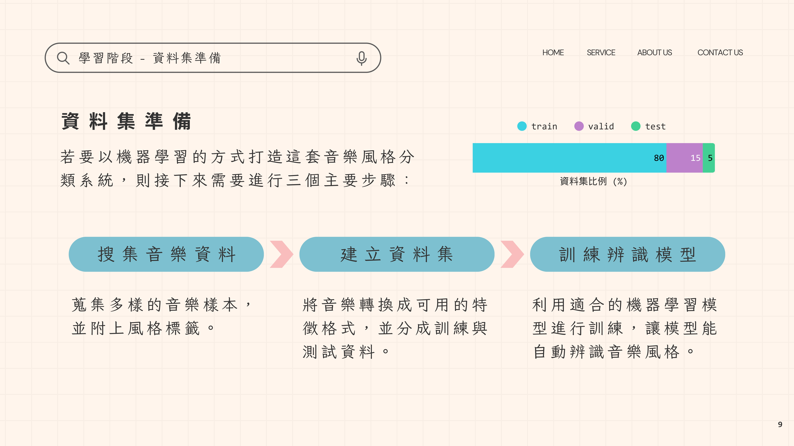
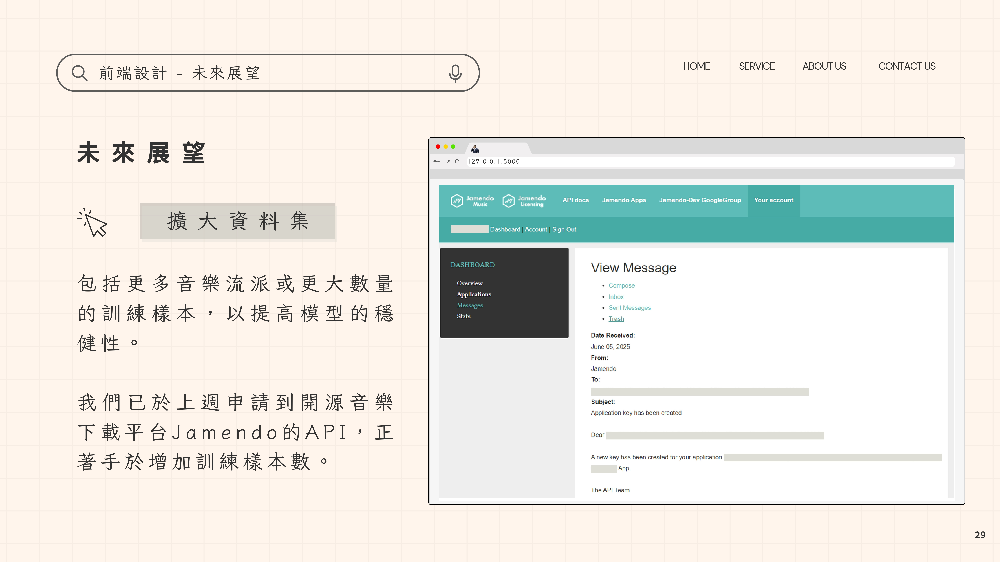
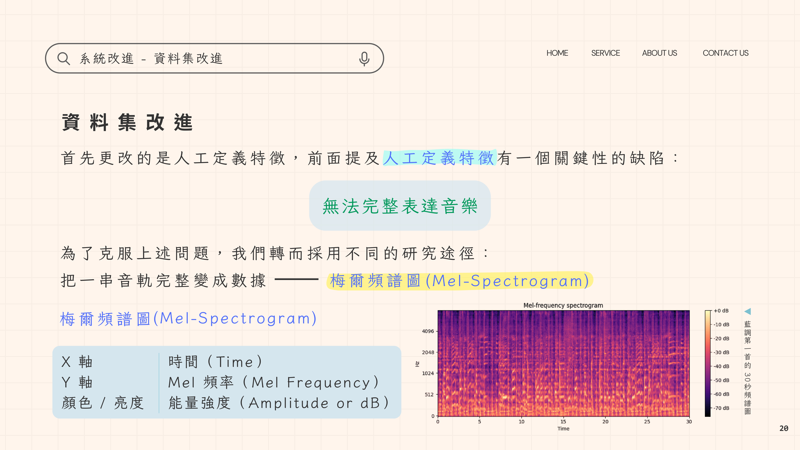
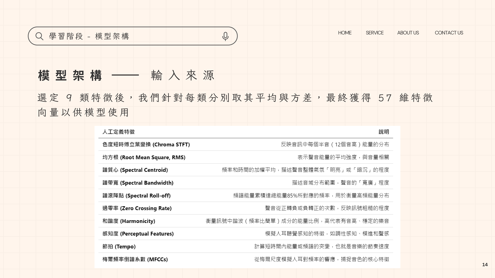
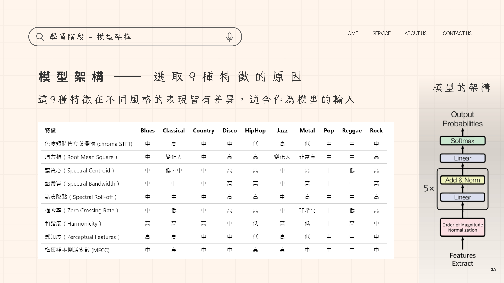
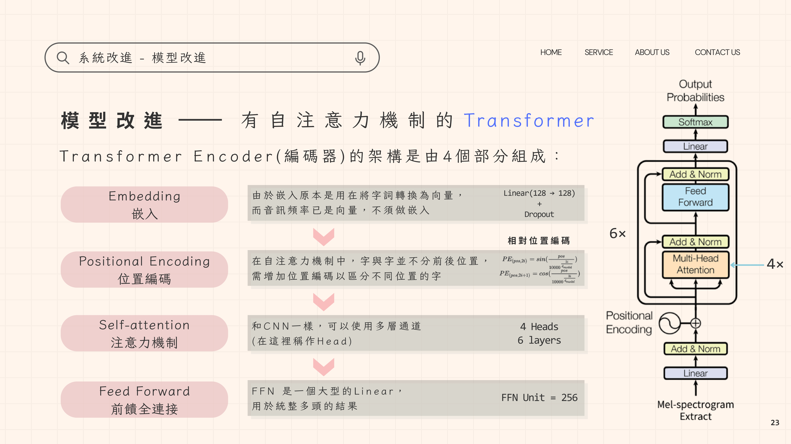
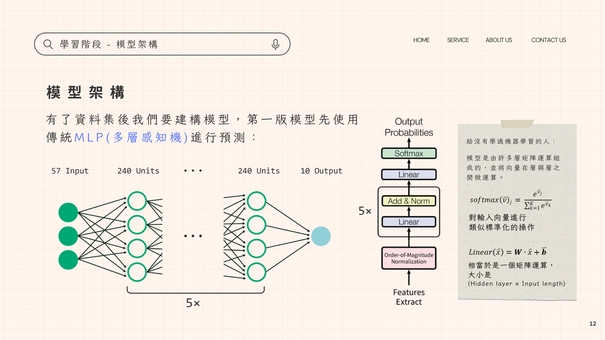
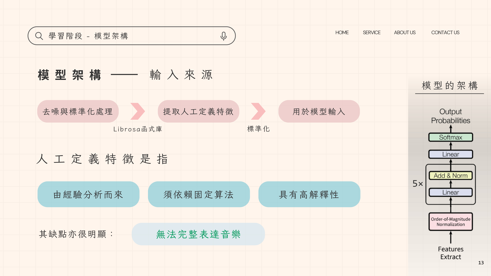
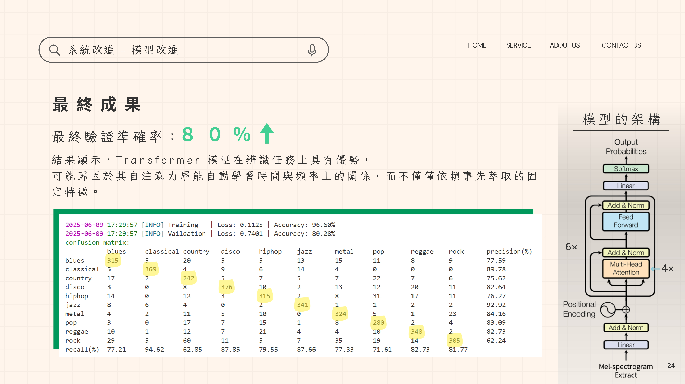
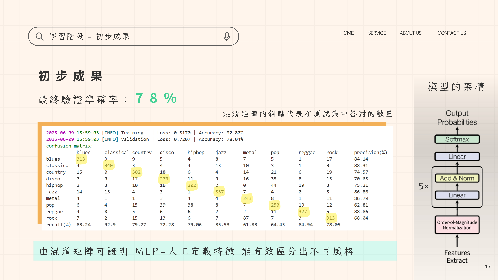

#  我們如何做出這個成果的？

## 搜集音樂資料

資料格式和 Tzanetakis 與 Cook（2002）[(1)](https://www.cs.cmu.edu/~gtzan/work/pubs/tsap02gtzan.pdf) 所使用的資料集形式類似：

| 風格 Genres | 資料筆數 |
| -------- | -------- |
|藍調 (blues)|2100|
|古典(classical)|2100|
|鄉村(country)|2100|
|舞廳(disco)|2100|
|嘻哈(hiphop)|2100|
|爵士(jazz)|2099|
|重金屬(metal)|2100|
|流行(pop)|2100|
|雷鬼(reggae)|2100|
|搖滾(rock)|2100|

### 音檔來源

| 來源 | 數量(首) |
| -------- | -------- |
| 來源於kaggle公開的音樂風格分類資料集[(2)](https://www.kaggle.com/datasets/andradaolteanu/gtzan-dataset-music-genre-classification) | 999 | 
|來源於youtube風格推薦下載|2000|
|來源於Jamendo申請之API[(3)](https://www.jamendo.com/)|18000|
> Jamendo申請API(已實踐)
> 

---
## 建立資料集及預處理

### 梅爾頻譜圖(Mel-Spectrogram)

> 我們將梅爾頻譜圖切成**3秒**的段落，以時間作為序列(sequence)輸入模型
> <left></left>

| 表現手法     | 意義                        |
| ----------- | --------------------------|
| X 軸(橫軸)   | 時間（Time）                |
| Y 軸(縱軸)   | Mel 頻率（Mel Frequency）   |
| 顏色 / 亮度  | 能量強度（Amplitude or dB）   |

> #### v0.1.0 的  MLP 輸入特徵 是什麼？
> <left></left>
>
> <left></left>

## 建立模型架構

### version 0.2.0 : Transformer Encoder

| 模型區塊                     | 架構                      | 說明                                                   |
| --------------------------- | ------------------------- | --------------------------------------------------- |
| Embedding 嵌入              | Linear(128 → 128)+Dropout | 梅爾頻譜圖已可將每刻視為向量，不須做嵌入                    |
| PE 位置編碼 | 傳統相對位置編碼              | _______ |
| Self-attention 自注意力機制   | 4 Heads × 6 layers        | 音樂可視為「時間刻」所拼出之句子，自注意力可取得每刻間的關係    |
| FFN 前饋網路      | FFN(128 → 256 → 128)      | 統整多頭分析之結果                                       |
---

> #### Transformer 的 self-attention 是什麼？
> <left></left>

---
### version 0.1.0 : MLP model

---

## 模型訓練及結果

### 雙版本成果對比：
|  version 0.2.0 : Transformer Encoder |  version 0.1.0 : MLP model |
| ----------------------- | ------------------------- |
 Accuracy 超過80%

 | Accuracy 78%

