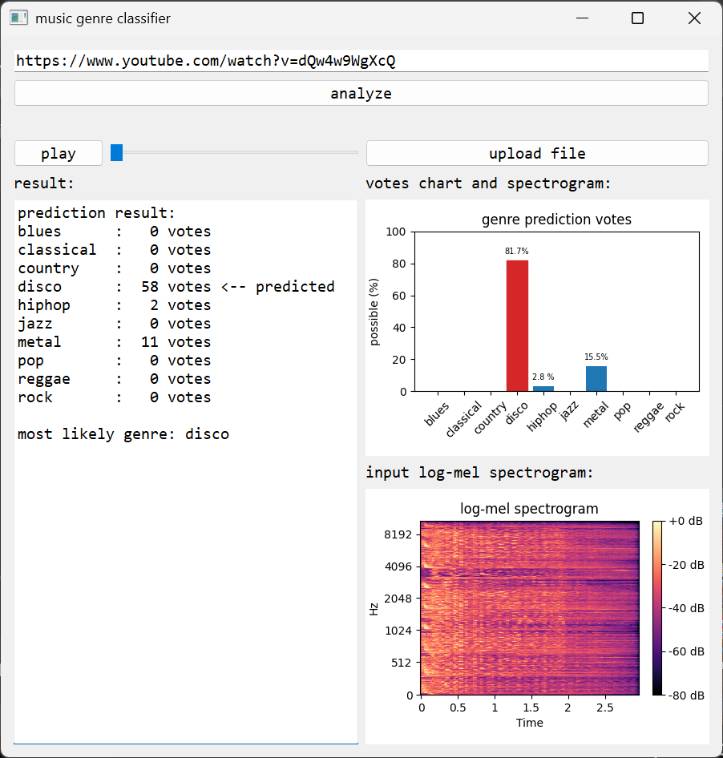
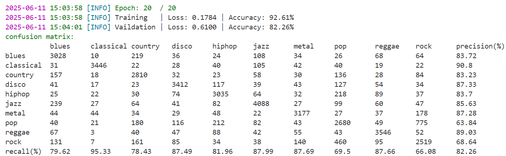

# Music Genre Predictor 「解碼音符」
### 基於深度學習的音樂風格分析    

## 我們做了什麼？

我們以Transformer Encoder作為模型，辨認音樂風格

## 我們為什麼要做這個項目？
#### 對音樂的熱忱
> 我們的成員都十分熱愛音樂，不僅平時喜歡聆聽各種類型的音樂，也常參與與音樂相關的社團及活動。我們在音樂中找到的共鳴與熱情，是團隊凝聚力的重要來源，也讓我們在這次的專題或報告中更能發揮創意與熱情。
#### 打造開放易用音樂分類系統
> 當今線上音樂與影音平台盛行，大量音樂內容需分類管理。雖然市面上已有許多自動辨識音樂風格的工具，但多數不開源或需付費，使用不便。因此，我們希望開發一套自動化的音樂風格分類系統，讓大眾更容易了解並學習自己喜愛的音樂風格。

## 我們如何做出這個成果的？
[了解更多...](MODEL.md)

## 我們的發表報告
[了解更多...](REPORT.md)

> © 2025 by yoshi-huang  