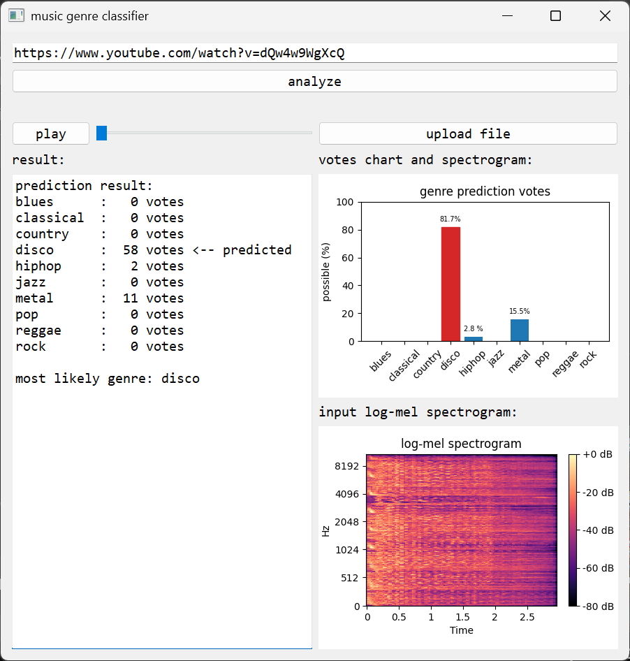
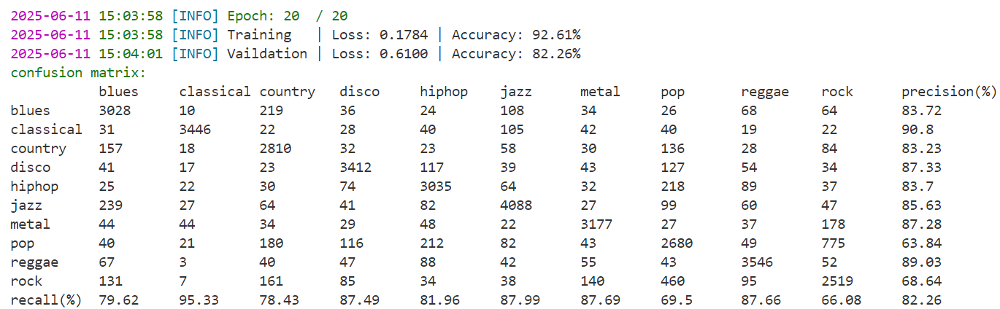
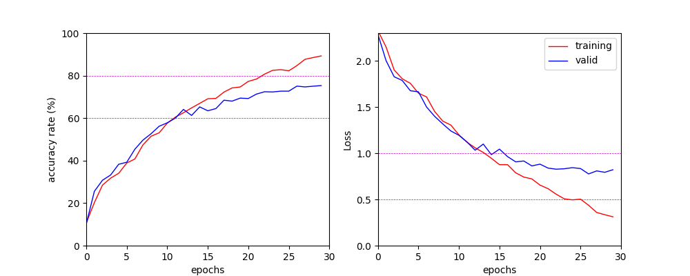
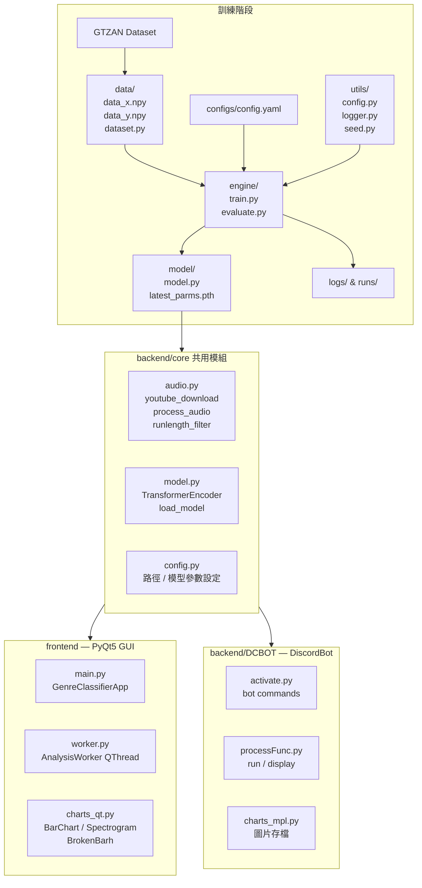
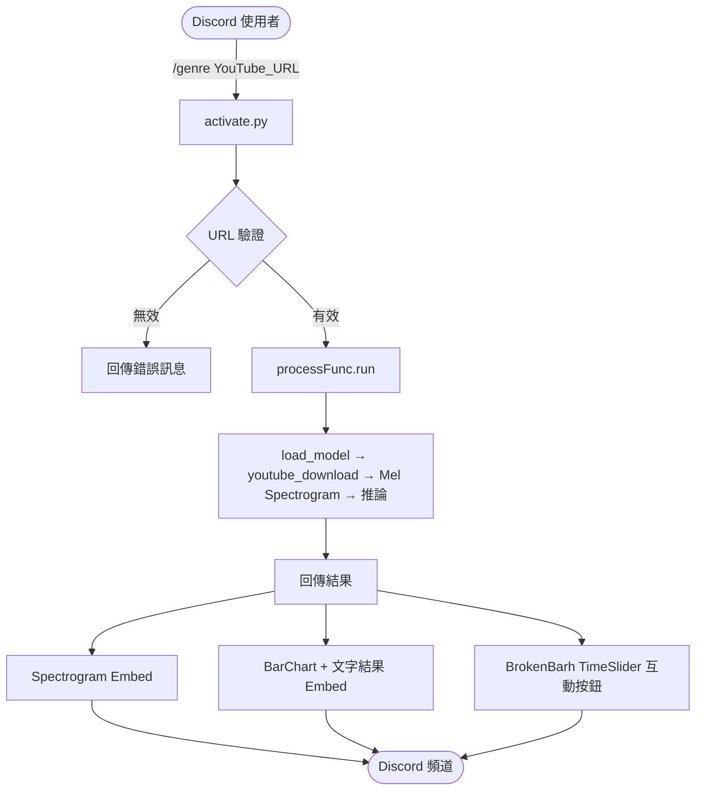
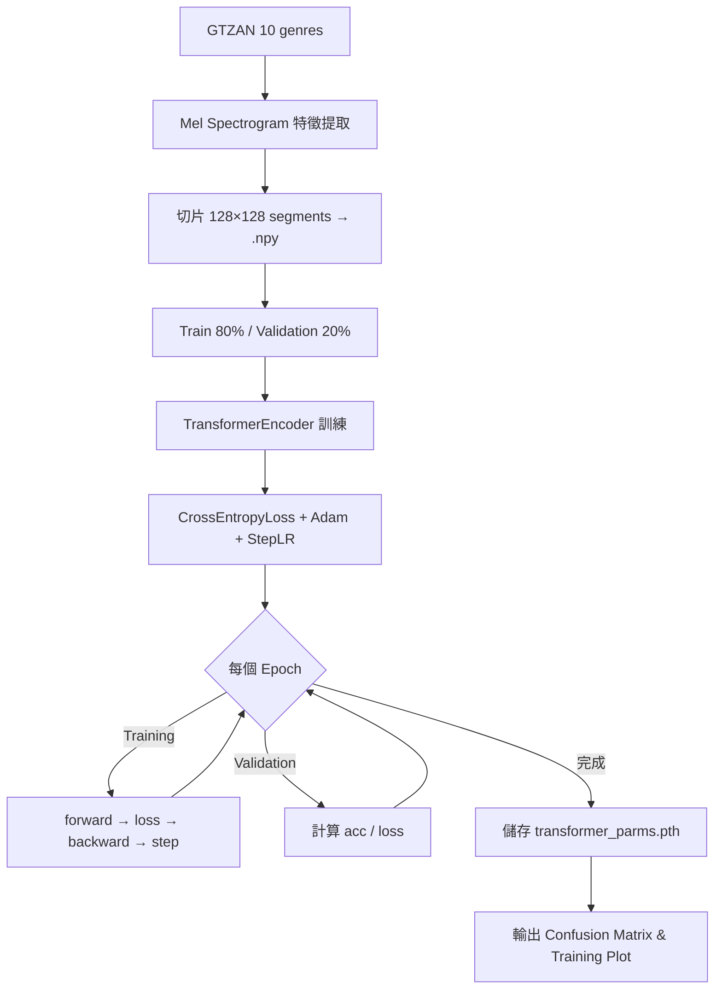

# Music Genre Predictor 「解碼音符」
### 基於深度學習的音樂風格分析

[](https://github.com/yoshi-huang)
[](https://www.threads.com/@yoshi.wm_)
[](https://discord.com/channels/@me/874233210190573578)

---

## 如何使用

### 環境安裝

```bash
pip install -r requirements.txt
```

> 需要額外安裝 [FFmpeg](https://ffmpeg.org/download.html) 並加入系統 PATH，供 yt-dlp 轉換音訊格式使用。

---

### GUI 桌面應用程式

```bash
python frontend/main.py
```

啟動後可透過兩種方式分析音樂：

1. 在輸入框貼上 YouTube 網址，點擊 **Analyze** 自動下載並分析
2. 點擊 **Upload File** 選擇本機 `.mp3` 或 `.wav` 檔案直接分析

分析完成後會顯示：
- 各風格投票長條圖
- Log-Mel 頻譜圖
- 時間軸風格分段圖（可橫向捲動）

---

### Discord Bot

1. 在 `backend/config.yaml` 填入 Bot Token，或設定環境變數 `DISCORD_BOT_TOKEN`
2. 啟動 Bot：

```bash
python backend/DCBOT/activate.py
```

3. 在 Discord 頻道輸入指令：

```
/genre https://www.youtube.com/watch?v=...
```

---

### 模型訓練

```bash
cd Train
python main.py
```

訓練設定請修改 `Train/configs/config.yaml`，訓練完成後模型權重會儲存至 `Train/model/transformer_parms.pth`。

---

## 我們做了什麼？

以 Transformer Encoder 為核心模型，自動辨識音樂風格，並提供兩種使用介面：

<center></center>

- PyQt5 桌面 GUI（支援本地檔案與 YouTube URL 輸入）
- Discord Bot（透過指令觸發推論並回傳視覺化結果）

<center></center>
<center></center>

---

## 為什麼做這個專案？

#### 對音樂的熱忱
本專案的成員都十分熱愛音樂，不僅平時喜歡聆聽各種類型的音樂，也常參與音樂相關的社團及活動。音樂中找到的共鳴與熱情，是團隊凝聚力的重要來源。

#### 打造開放易用的音樂分類系統
當今線上音樂與影音平台盛行，大量音樂內容需分類管理。市面上雖有自動辨識音樂風格的工具，但多數不開源或需付費。因此我們希望開發一套自動化的音樂風格分類系統，讓大眾更容易了解並學習自己喜愛的音樂風格。

---

## 資料集

資料格式參考 Tzanetakis 與 Cook（2002）的 GTZAN 資料集，共 10 種音樂風格：

| 風格 | 資料筆數 |
| :--- | ---: |
| 藍調 (blues) | 2100 |
| 古典 (classical) | 2100 |
| 鄉村 (country) | 2100 |
| 舞廳 (disco) | 2100 |
| 嘻哈 (hiphop) | 2100 |
| 爵士 (jazz) | 2099 |
| 重金屬 (metal) | 2100 |
| 流行 (pop) | 2100 |
| 雷鬼 (reggae) | 2100 |
| 搖滾 (rock) | 2100 |

音檔來源：

| 來源 | 數量（首） |
| :--- | ---: |
| Kaggle GTZAN 公開資料集 | 999 |
| YouTube 風格推薦下載 | 2000 |
| Jamendo API | 18000 |

---

## 模型架構

### Transformer Encoder（v0.2.0）

以 Mel Spectrogram 的每個時間幀作為序列輸入，透過 Self-Attention 捕捉時間幀之間的關係。

| 模型區塊 | 架構 | 說明 |
| :--- | :--- | :--- |
| Embedding | BatchNorm + Linear(128 → 128) | 梅爾頻譜圖每幀即為向量，不須額外嵌入 |
| Positional Encoding | sin/cos 相對位置編碼 | 保留時間序列位置資訊 |
| Self-Attention | 4 Heads × 6 Layers | 捕捉每個時間幀之間的關係 |
| FFN | 128 → 256 → 128 | 統整多頭注意力結果 |
| Pooling | Mean Pooling | 將序列壓縮為單一向量 |
| Classifier | BatchNorm + Linear → 10 classes | 輸出各風格機率 |

訓練設定：CrossEntropyLoss、Adam optimizer、StepLR scheduler

### 版本對比

| 版本 | 模型 | 準確率 |
| :--- | :--- | ---: |
| v0.2.0 | Transformer Encoder | 82.2% |
| v0.1.0 | MLP | 78% |

---

## 系統架構


```mermaid
flowchart TD
    subgraph Train [訓練階段]
        T1[GTZAN Dataset] --> T2[data/\ndata_x.npy\ndata_y.npy\ndataset.py]
        T2 --> T3[engine/\ntrain.py\nevaluate.py]
        T3 --> T4[model/\nmodel.py\nlatest_parms.pth]
        T5[configs/config.yaml] --> T3
        T6[utils/\nconfig.py\nlogger.py\nseed.py] --> T3
        T3 --> T7[logs/ & runs/]
    end

    subgraph Backend [backend/core 共用模組]
        B1[audio.py\nyoutube_download\nprocess_audio\nrunlength_filter]
        B2[model.py\nTransformerEncoder\nload_model]
        B3[config.py\n路徑 / 模型參數設定]
    end

    subgraph Frontend [frontend — PyQt5 GUI]
        F1[main.py\nGenreClassifierApp]
        F2[worker.py\nAnalysisWorker QThread]
        F3[charts_qt.py\nBarChart / Spectrogram\nBrokenBarh]
    end

    subgraph DCBOT [backend/DCBOT — DiscordBot]
        D1[activate.py\nbot commands]
        D2[processFunc.py\nrun / display]
        D3[charts_mpl.py\n圖片存檔]
    end

    T4 --> Backend
    Backend --> Frontend
    Backend --> DCBOT
```

```
Frontend/
├── ui/
│   ├── charts_qt.py        # Qt 圖形化介面顯示（BarChart / Spectrogram / BrokenBarh）
│   └── worker.py           # AnalysisWorker QThread（背景推論）
└── main.py                 # GUI 主程式入口

Backend/
├── audio_temp_save/        # 暫存使用者上傳 / 下載之音檔
├── core/
│   ├── audio.py            # youtube_download、process_audio、runlength_filter
│   ├── charts_mpl.py       # 產生視覺化圖表（頻譜圖、長條圖、分段圖）
│   ├── model.py            # 載入訓練完成之模型進行推論
│   └── config.py           # 系統參數設定
├── DCBOT/
│   ├── activate.py         # Discord Bot 指令控制
│   └── processFunc.py      # 推論流程與圖表切分
├── config.yaml             # 系統設定檔
└── transformer_parms.pth   # 模型權重檔案

Train/
├── configs/
│   └── config.yaml         # 訓練超參數（學習率、批次大小等）
├── data/
│   ├── dataset.py          # 資料載入與前處理
│   ├── data_x.npy          # 特徵資料集
│   └── data_y.npy          # 標籤資料集
├── engine/
│   ├── train.py            # 模型主訓練流程
│   └── evaluate.py         # 模型評估（準確率、驗證/測試集損失）
├── model/
│   ├── model.py            # 模型架構定義
│   └── transformer_parms.pth  # 訓練完成模型權重
├── utils/
│   ├── config.py           # 輔助設定
│   ├── logger.py           # 訓練紀錄初始化
│   └── seed.py             # 隨機種子（確保結果可再現）
├── logs/                   # 訓練紀錄
├── runs/                   # TensorBoard 輸出
└── main.py                 # 訓練主程式入口
```

---

## 系統流程

### GUI 推論流程


```mermaid
flowchart TD
    U([使用者]) --> A{輸入來源}
    A -->|YouTube URL| B[yt_dlp 下載 → mp3]
    A -->|本地 mp3 / wav| C[直接讀取]
    B --> D[process_audio：Mel Spectrogram 切片]
    C --> D
    D --> E[TransformerEncoder 推論]
    E --> F[Softmax → argmax 投票 + runlength_filter]
    F --> G[BarChart / Spectrogram / BrokenBarh]
    G --> H([GUI 顯示結果])
```

### Discord Bot 推論流程


```mermaid
flowchart TD
    U([Discord 使用者]) -->|/genre YouTube_URL| A[activate.py]
    A --> B{URL 驗證}
    B -->|無效| Z[回傳錯誤訊息]
    B -->|有效| C[processFunc.run]
    C --> D[load_model → youtube_download → Mel Spectrogram → 推論]
    D --> E[回傳結果]
    E --> F[Spectrogram Embed]
    E --> G[BarChart + 文字結果 Embed]
    E --> H[BrokenBarh TimeSlider 互動按鈕]
    F --> U2([Discord 頻道])
    G --> U2
    H --> U2
```

### 模型訓練流程


```mermaid
flowchart TD
    A[GTZAN 10 genres] --> B[Mel Spectrogram 特徵提取]
    B --> C[切片 128×128 segments → .npy]
    C --> D[Train 80% / Validation 20%]
    D --> E[TransformerEncoder 訓練]
    E --> F[CrossEntropyLoss + Adam + StepLR]
    F --> G{每個 Epoch}
    G -->|Training| H[forward → loss → backward → step]
    G -->|Validation| I[計算 acc / loss]
    H --> G
    I --> G
    G -->|完成| J[儲存 transformer_parms.pth]
    J --> K[輸出 Confusion Matrix & Training Plot]
```

---

## 硬體與軟體環境

### 開發者硬體

| 機型 | 處理器 | 記憶體 | 儲存 |
| :--- | :--- | ---: | ---: |
| HP Laptop 14-ep0xxx | Intel Core i7-1360P (2.20 GHz) | 16 GB | 1TB SSD |
| MacBook Pro 14" (2024) | Apple M4 Pro (14C CPU + 20C GPU) | 24 GB | 512GB SSD |

### 伺服器

| 機型 | 處理器 | 記憶體 | 儲存 |
| :--- | :--- | ---: | ---: |
| 遠端工作站 (Ubuntu 22.04 LTS) | Intel Xeon Gold 6414U | 512 GB | 2TB SSD |

### 軟體環境

| 項目 | 版本 |
| :--- | ---: |
| 作業系統 | Windows 11 |
| IDE | Visual Studio Code 1.85 |
| Python | 3.11.7 |

### 主要套件

| 類別 | 套件 | 版本 |
| :--- | :--- | ---: |
| 模型 | PyTorch | 2.5.1 |
|  | Scikit-learn | 1.8.0 |
|  | NumPy | 1.26.4 |
| 多媒體 | Librosa | 0.11.0 |
|  | yt-dlp | 2026.2.4 |
| 通訊 | discord.py | 2.3.2 |
|  | Requests | 2.32.3 |
| 日誌 | TensorBoard | 2.20.0 |
|  | tqdm | 4.67.1 |
| 其他 | PyYAML | 6.0.1 |
|  | Matplotlib | 3.9.2 |

---

> © 2026 by yoshi-huang
