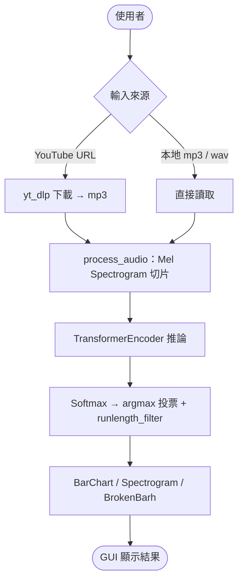
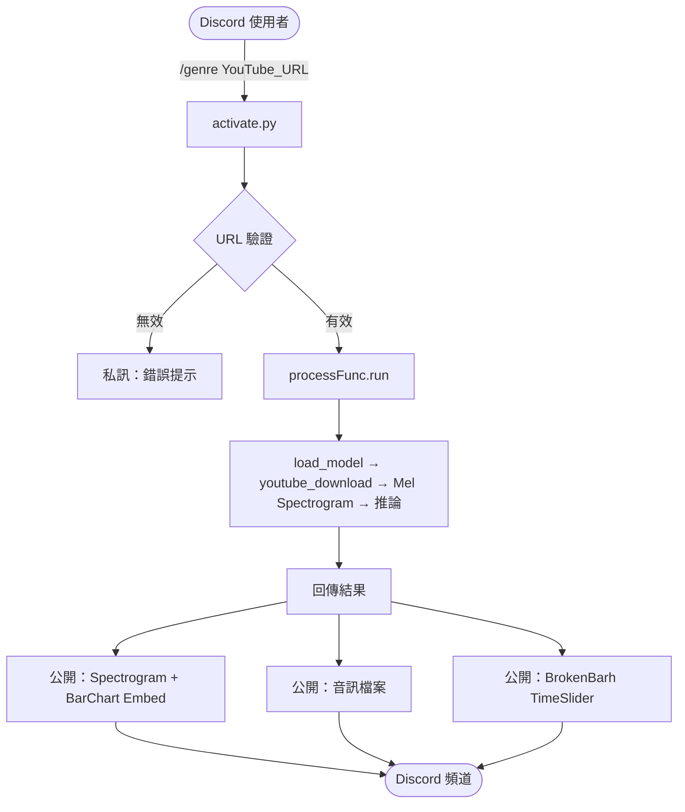
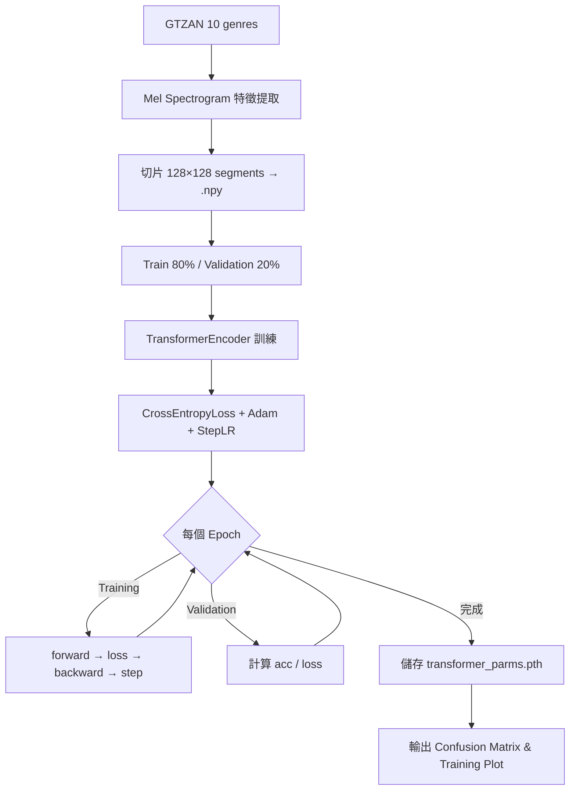

# Music Genre Predictor 「解碼音符」
### 基於深度學習的音樂風格分析

[](https://github.com/yoshi-huang)
[](https://www.threads.com/@yoshi.wm_)

```
Contributors

總負責人：HSNU 161425 黃宥熙

團隊成員：
    HSNU 161401 莊子函
    HSNU 161404 葉采竺
    HSNU 161419 陳言碩
    HSNU 161425 黃宥熙
    HSNU 161430 賴守義
    HSNU 161431 魏得洋

顧問指導：柯佳伶 教授、李啟龍 主任
```

---

## 目錄

- [環境安裝](#環境安裝)
- [使用方式](#使用方式)
- [專案架構](#專案架構)
- [系統流程](#系統流程)
- [資料集](#資料集)
- [模型架構](#模型架構)
- [硬體與軟體環境](#硬體與軟體環境)

---

## 環境安裝

```bash
pip install -r requirements.txt
```

> 需額外安裝 [FFmpeg](https://ffmpeg.org/download.html) 並加入系統 PATH，供 yt-dlp 轉換音訊格式使用。

---

## 使用方式

### GUI 桌面應用程式

```bash
python frontend/main.py
```

支援兩種輸入方式：

1. 貼上 YouTube 網址，點擊 **Analyze** 自動下載並分析
2. 點擊 **Upload File** 選擇本機 `.mp3` 或 `.wav` 檔案直接分析

分析完成後顯示：
- 各風格投票長條圖
- Log-Mel 頻譜圖
- 時間軸風格分段圖（可橫向捲動）

---

### Discord Bot

**1. 設定 Token**

在 `backend/config.yaml` 填入 Bot Token，或設定環境變數：

```bash
export DISCORD_BOT_TOKEN="your_token_here"
```

**2. 啟動 Bot**

```bash
python backend/DCBOT/activate.py
```

**3. 使用指令**

```
/genre https://www.youtube.com/watch?v=...
```

Bot 會依序回傳：
- 私訊：分析進度通知（僅觸發者可見）
- 公開：Mel 頻譜圖 + 風格投票長條圖 + 文字結果
- 公開：音訊檔案（若小於 25 MB）
- 公開：時間軸分段圖（含 ◀️ / ▶️ 翻頁按鈕）

---

### 模型訓練

```bash
python Train/main.py
```

訓練超參數請修改 `Train/configs/config.yaml`，完成後模型權重儲存至 `Train/model/transformer_parms.pth`。

---

## 專案架構

```
.
├── frontend/
│   ├── main.py                 # GUI 主程式入口
│   └── ui/
│       ├── charts_qt.py        # Qt 圖表元件（BarChart / Spectrogram / BrokenBarh）
│       └── worker.py           # AnalysisWorker QThread（背景推論）
│
├── backend/
│   ├── config.yaml             # 系統設定檔（路徑、模型參數、Bot 設定）
│   ├── transformer_parms.pth   # 模型權重
│   ├── audio_temp_save/        # 暫存下載 / 上傳的音訊檔
│   ├── core/
│   │   ├── audio.py            # youtube_download、process_audio、runlength_filter
│   │   ├── charts_mpl.py       # Matplotlib 圖表輸出（供 DCBOT 使用）
│   │   ├── model.py            # TransformerEncoder 定義與載入
│   │   └── config.py           # 讀取 config.yaml，提供全域設定
│   └── DCBOT/
│       ├── activate.py         # Discord Bot 指令與事件處理
│       └── processFunc.py      # 推論流程（模型快取、圖表生成）
│
├── Train/
│   ├── main.py                 # 訓練主程式入口
│   ├── configs/config.yaml     # 訓練超參數
│   ├── data/
│   │   └── dataset.py          # 資料載入與前處理
│   ├── engine/
│   │   ├── train.py            # 訓練迴圈
│   │   └── evaluate.py         # 驗證 / 測試評估
│   ├── model/
│   │   └── model.py            # 模型架構定義
│   ├── utils/
│   │   ├── config.py           # 訓練設定輔助
│   │   ├── logger.py           # TensorBoard logger 初始化
│   │   └── seed.py             # 隨機種子（確保結果可再現）
│   ├── logs/                   # 訓練紀錄
│   └── runs/                   # TensorBoard 輸出
│
└── web/
    ├── app.py                  # Web 後端（Flask）
    └── static/
        ├── index.html
        ├── main.js
        └── style.css
```

---

## 系統流程

### GUI 推論流程


```mermaid
flowchart TD
    U([使用者]) --> A{輸入來源}
    A -->|YouTube URL| B[yt_dlp 下載 → mp3]
    A -->|本地 mp3 / wav| C[直接讀取]
    B --> D[process_audio：Mel Spectrogram 切片]
    C --> D
    D --> E[TransformerEncoder 推論]
    E --> F[Softmax → argmax 投票 + runlength_filter]
    F --> G[BarChart / Spectrogram / BrokenBarh]
    G --> H([GUI 顯示結果])
```

### Discord Bot 推論流程


```mermaid
flowchart TD
    U([Discord 使用者]) -->|/genre YouTube_URL| A[activate.py]
    A --> B{URL 驗證}
    B -->|無效| Z[私訊：錯誤提示]
    B -->|有效| C[processFunc.run]
    C --> D[load_model → youtube_download → Mel Spectrogram → 推論]
    D --> E[回傳結果]
    E --> F[公開：Spectrogram + BarChart Embed]
    E --> G[公開：音訊檔案]
    E --> H[公開：BrokenBarh TimeSlider]
    F --> CH([Discord 頻道])
    G --> CH
    H --> CH
```

### 模型訓練流程


```mermaid
flowchart TD
    A[GTZAN 10 genres] --> B[Mel Spectrogram 特徵提取]
    B --> C[切片 128×128 segments → .npy]
    C --> D[Train 80% / Validation 20%]
    D --> E[TransformerEncoder 訓練]
    E --> F[CrossEntropyLoss + Adam + StepLR]
    F --> G{每個 Epoch}
    G -->|Training| H[forward → loss → backward → step]
    G -->|Validation| I[計算 acc / loss]
    H --> G
    I --> G
    G -->|完成| J[儲存 transformer_parms.pth]
    J --> K[輸出 Confusion Matrix & Training Plot]
```

---

## 資料集

資料格式參考 Tzanetakis 與 Cook（2002）的 GTZAN 資料集，共 10 種音樂風格：

| 風格 | 資料筆數 |
| :--- | ---: |
| 藍調 (blues) | 2100 |
| 古典 (classical) | 2100 |
| 鄉村 (country) | 2100 |
| 舞廳 (disco) | 2100 |
| 嘻哈 (hiphop) | 2100 |
| 爵士 (jazz) | 2099 |
| 金屬 (metal) | 2100 |
| 流行 (pop) | 2100 |
| 雷鬼 (reggae) | 2100 |
| 搖滾 (rock) | 2100 |

音檔來源：

| 來源 | 數量（首） |
| :--- | ---: |
| Kaggle GTZAN 公開資料集 | 999 |
| YouTube 風格推薦下載 | 2000 |
| Jamendo API | 18000 |

---

## 模型架構

### Transformer Encoder（v0.2.0）

以 Mel Spectrogram 的每個時間幀作為序列輸入，透過 Self-Attention 捕捉時間幀之間的關係。

| 模型區塊 | 架構 | 說明 |
| :--- | :--- | :--- |
| Embedding | BatchNorm + Linear(128 → 128) | 梅爾頻譜圖每幀即為向量，不須額外嵌入 |
| Positional Encoding | sin/cos 相對位置編碼 | 保留時間序列位置資訊 |
| Self-Attention | 4 Heads × 6 Layers | 捕捉每個時間幀之間的關係 |
| FFN | 128 → 256 → 128 | 統整多頭注意力結果 |
| Pooling | Mean Pooling | 將序列壓縮為單一向量 |
| Classifier | BatchNorm + Linear → 10 classes | 輸出各風格機率 |

訓練設定：CrossEntropyLoss、Adam optimizer、StepLR scheduler

### 版本對比

| 版本 | 模型 | 準確率 |
| :--- | :--- | ---: |
| v0.2.0 | Transformer Encoder | 82.2% |
| v0.1.0 | MLP | 78% |

---

## 硬體與軟體環境

### 開發者硬體

| 機型 | 處理器 | 記憶體 | 儲存 |
| :--- | :--- | ---: | ---: |
| HP Laptop 14-ep0xxx | Intel Core i7-1360P (2.20 GHz) | 16 GB | 1 TB SSD |
| MacBook Pro 14" (2024) | Apple M4 Pro (14C CPU + 20C GPU) | 24 GB | 512 GB SSD |

### 訓練伺服器

| 機型 | 處理器 | 記憶體 | 儲存 |
| :--- | :--- | ---: | ---: |
| 遠端工作站 (Ubuntu 22.04 LTS) | Intel Xeon Gold 6414U | 512 GB | 2 TB SSD |

### 軟體環境

| 項目 | 版本 |
| :--- | ---: |
| Python | 3.11.7 |
| 作業系統 | Windows 11 |
| IDE | Visual Studio Code 1.85 |

### 主要套件

| 類別 | 套件 | 版本 |
| :--- | :--- | ---: |
| 模型 | PyTorch | 2.5.1 |
| | Scikit-learn | 1.8.0 |
| | NumPy | 1.26.4 |
| 多媒體 | Librosa | 0.11.0 |
| | yt-dlp | 2026.2.4 |
| 通訊 | discord.py | 2.3.2 |
| 視覺化 | Matplotlib | 3.9.2 |
| | PyQt5 | 5.15.x |
| 日誌 | TensorBoard | 2.20.0 |
| | tqdm | 4.67.1 |
| 其他 | PyYAML | 6.0.1 |
| | Requests | 2.32.3 |

---

> © 2026 yoshi-huang
